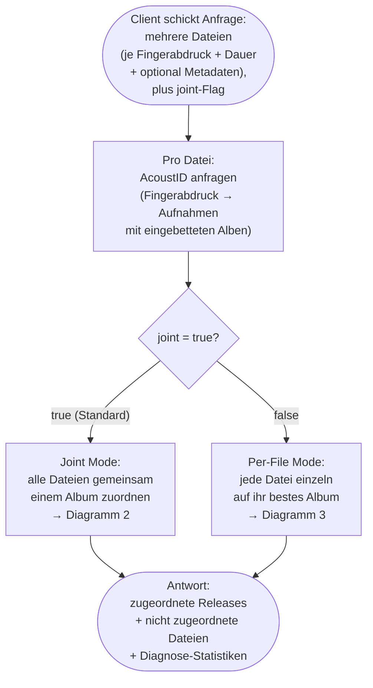
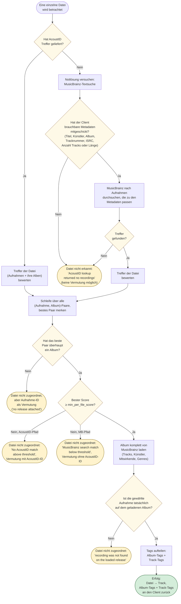

# Ablauf der Musik-Erkennung

Dieses Dokument beschreibt den vollständigen Ablauf einer
`POST /api/lookup`-Anfrage: was der Service tut, wie er entscheidet, und
welche Sonderfälle dabei auftreten können. Es ist so geschrieben, dass es
ohne Blick in den Quellcode verständlich ist.

## Begriffe

- **Audio-Fingerabdruck (Chromaprint)**: Kompakte „Signatur" der Audio-Welle.
  Verschiedene Aufnahmen desselben Songs ergeben sehr ähnliche
  Fingerabdrücke. Der Client erzeugt ihn vorab (z. B. mit `fpcalc`) und
  schickt ihn zusammen mit der Dauer in Sekunden.
- **AcoustID**: Online-Dienst, der Fingerabdrücke nachschlägt und passende
  Aufnahmen aus dem MusicBrainz-Katalog zurückliefert – inklusive
  eingebetteter Album- und Track-Informationen.
- **MusicBrainz**: Frei zugänglicher Musik-Katalog mit Releases, Aufnahmen,
  Tracks, Künstlern und Metadaten. Wird sowohl von AcoustID intern genutzt
  als auch direkt vom Service angefragt.
- **Metadaten**: Optionale Zusatzinformationen, die der Client je Datei
  mitschicken kann: Titel, Künstler, Albumname, Tracknummer, Länge, ISRC,
  Veröffentlichungsdatum, Format, Land, Album-Typ usw. Sie verbessern die
  Bewertung erheblich, sind aber nicht zwingend.
- **Joint Mode** (`joint: true`, default): Mehrere Dateien werden als Gruppe
  einem gemeinsamen Album zugeordnet. Sinnvoll z. B. wenn ein ganzes Album
  in einer Anfrage steckt.
- **Per-File Mode** (`joint: false`): Jede Datei wird unabhängig auf ihr
  bestes Album abgebildet, ohne Rücksicht auf die anderen Dateien im Batch.
- **Schwellwerte**: Drei Stellschrauben, die kontrollieren, wie streng der
  Service eine Zuordnung verlangt:
  - `min_per_file_score` (Default 0,5) – Mindest-Score, den die Bewertung
    einer Datei gegen eine Aufnahme/ein Album erreichen muss.
  - `min_coverage` (Default 0,6) – Anteil der Dateien einer Auswahl, der
    diesen Score erreichen muss, damit das Album im Joint Mode überhaupt
    akzeptiert wird.
  - `split_margin` (Default 0,15) – Wie viel besser ein alternatives Album
    sein muss, damit eine Datei aus der primären Auswahl herausgelöst wird.

## Eingabeparameter

| Feld | Default | Bedeutung |
|---|---|---|
| `items[]` | (Pflicht) | Pro Datei: ID, Fingerabdruck, Dauer, optional Metadaten |
| `joint` | `true` | Joint- vs. Per-File-Verfahren |
| `preferred_release_countries` | `[]` | Bevorzugte Veröffentlichungsländer (ISO-Codes), beeinflussen das Album-Ranking |
| `thresholds` | siehe oben | `min_per_file_score`, `min_coverage`, `split_margin` |
| `search_limit` | `10` | Maximale AcoustID-Kandidaten je Datei |

## Diagramm 1: Gesamtablauf

## Diagramm 2: Joint Mode – Album zuerst, Tracks danach

Im Joint Mode versucht der Service, möglichst viele Dateien dem **gleichen
Album** zuzuordnen. Das geschieht in zwei Stufen.

```mermaid
flowchart TD
    Start(["Joint Mode startet"])
    Start --> Norm["Metadaten vorbereiten:<br/>fehlende Metadaten werden<br/>durch leere Platzhalter ersetzt,<br/>damit jede Datei bewertbar bleibt"]
    Norm --> S1Title{{"Stufe 1:<br/>Album-Auswahl"}}

    S1Title --> S1Score["Für jede mögliche Kombination<br/>(Datei, Aufnahme, Album)<br/>einen Score berechnen<br/>(siehe Bewertungsfunktion)"]
    S1Score --> S1Sum["Pro Album die Scores<br/>aller Dateien aufsummieren<br/>(joint score)"]
    S1Sum --> S1Pick["Bestes Album wählen.<br/>Bei Gleichstand:<br/>bevorzugtes Land,<br/>Format-Rang,<br/>Veröffentlichungsdatum"]

    S1Pick --> S1Split{"Hat eine Datei eine<br/>Alternative, die deutlich<br/>besser passt?<br/>(Abstand ≥ split_margin)"}
    S1Split -->|"Ja"| S1Iter["Datei abspalten,<br/>zweite Album-Auswahl<br/>für sie starten"]
    S1Iter --> S1Pick
    S1Split -->|"Nein"| S1Cov{"Coverage-Check:<br/>passt das Album zu<br/>genug Dateien?<br/>(Anteil ≥ min_coverage<br/>mit Score ≥ min_per_file_score)"}

    S1Cov -->|"Nein"| Drop["Auswahl verwerfen,<br/>alle betroffenen Dateien<br/>landen im Rescue-Pfad"]
    S1Cov -->|"Ja"| S2Title{{"Stufe 2:<br/>Track-Zuordnung"}}

    S2Title --> S2Load["Album von MusicBrainz<br/>vollständig laden<br/>(alle Tracks, Künstler,<br/>Mitwirkende, …)"]
    S2Load --> S2Match["Bipartite Zuordnung:<br/>jede Datei bekommt<br/>höchstens einen Track,<br/>jeder Track höchstens<br/>eine Datei.<br/>Optimum nach<br/>ungarischer Methode"]

    S2Match --> S2Strong["Sonderregel:<br/>kennt AcoustID die exakte<br/>Aufnahme einer Datei,<br/>bekommt diese Datei<br/>den passenden Track<br/>garantiert (Score 1,0)"]
    S2Strong --> S2Filter{"Score je<br/>Datei-Track-Paar<br/>≥ min_per_file_score?"}

    S2Filter -->|"Ja"| Matched(["Datei → Track<br/>(mit aufbereiteten<br/>Album- und Track-Tags)"])
    S2Filter -->|"Nein"| Stranded["Datei bleibt übrig<br/>→ Rescue-Pfad"]

    Drop --> Rescue["Rescue:<br/>jede übrige Datei einzeln<br/>durch das Per-File-Verfahren<br/>laufen lassen"]
    Stranded --> Rescue
    Rescue --> RescueDetail(["siehe Diagramm 3"])

    Matched --> Out(["Joint-Releases<br/>+ Rescue-Ergebnisse<br/>+ nicht zuordenbare Dateien"])
    RescueDetail --> Out

    classDef stage fill:#e8eef9,stroke:#446
    classDef branch fill:#fef9e7,stroke:#a86
    classDef ok fill:#d4edda,stroke:#155724
    classDef warn fill:#fff3cd,stroke:#856404

    class S1Title,S2Title stage
    class S1Split,S1Cov,S2Filter branch
    class Matched ok
    class Drop,Stranded,Rescue warn
```

### Was passiert in Stufe 1?

Stufe 1 versucht, **ein passendes Album für die ganze Gruppe** zu finden.
Dazu werden für alle plausiblen (Datei, Aufnahme, Album)-Kombinationen
Scores berechnet und pro Album aufaddiert. Das Album mit der höchsten
Summe gewinnt; bei Gleichstand entscheiden bevorzugte Länder, Format und
Veröffentlichungsdatum.

Falls eine einzelne Datei woanders **deutlich** besser passt (mindestens
um `split_margin`), wird sie aus der primären Auswahl herausgelöst und
bekommt eine eigene Stufe-1-Iteration. So lassen sich z. B. Sampler und
Album in einer Anfrage trennen.

Bevor Stufe 2 startet, prüft ein **Coverage-Check**, ob genug Dateien gut
genug zum gewählten Album passen. Wenn nicht, wird die Auswahl verworfen
und alle betroffenen Dateien gehen in den Rescue-Pfad.

### Was passiert in Stufe 2?

Stufe 2 ordnet **konkrete Dateien zu konkreten Tracks** auf dem in Stufe 1
gewählten Album. Das ist eine bipartite Zuordnung – jede Datei bekommt
höchstens einen Track, jeder Track höchstens eine Datei. Die Auswahl
maximiert die Summe der Datei-Track-Scores (ungarische Methode).

Eine Sonderregel sorgt dafür, dass eine Datei, deren AcoustID-Lookup
bereits eindeutig auf eine bestimmte Aufnahme zeigt, den entsprechenden
Track garantiert bekommt. So überstimmt der Fingerabdruck reine
Metadaten-Ähnlichkeit, wenn er aussagekräftig ist.

Paare unterhalb des Schwellwerts werden nicht festgeschrieben; die
betroffenen Dateien gehen in den Rescue-Pfad.

## Diagramm 3: Per-Datei-Entscheidung

Wird in zwei Situationen aufgerufen: einmal als Hauptverfahren im Per-File
Mode, einmal als Rescue-Pfad für Dateien, die im Joint Mode übrig blieben.

## Bewertungsfunktion

Die Bewertung vergleicht die **Metadaten der Datei** mit einem **konkreten
Aufnahme-/Album-Kandidaten** und liefert einen Wert zwischen 0,0 und 1,0.
Sie ist die zentrale Größe, an der sich Stage 1, Stage 2 und der Per-File-
Pfad orientieren.

Die Bewertung setzt sich aus zwei Gruppen gewichteter Teilvergleiche zusammen:

**Track-Vergleiche** (Datei vs. einzelne Aufnahme):

| Feld | Gewicht | Vergleich |
|---|---|---|
| Titel | 13 | Texteinheit Titel ↔ Aufnahmetitel |
| Künstler | 4 | Künstler ↔ Künstlercredits der Aufnahme |
| Länge | 10 | Datei-Länge ↔ Aufnahme-Länge |
| Video-Flag | 2 | `is_video` ↔ Video-Eigenschaft |

**Album-Vergleiche** (Datei vs. konkretes Release):

| Feld | Gewicht | Vergleich |
|---|---|---|
| Album-Typ | 14 | z. B. „album", „single", „ep" |
| Albumtitel | 5 | Texteinheit |
| Album-Künstler | 4 | Künstlercredits des Albums |
| Anzahl Tracks | 4 | erwartet ↔ tatsächlich |
| Datum | 4 | Veröffentlichungsdatum |
| Land | 2 | Match gegen `preferred_release_countries` |
| Format | 2 | z. B. „CD", „Digital Media" |

**Regeln dazu:**

- Felder, für die der Client nichts geschickt hat, fließen **nicht** in die
  Bewertung ein.
- Zwei Ausnahmen: das **Land** zählt mit, sobald `preferred_release_countries`
  gesetzt ist (auch ohne Metadaten); das **Video-Flag** zählt immer mit
  (Default: `false` für beide Seiten → trifft).
- Der Endwert wird zusätzlich mit dem AcoustID-Konfidenzwert der Aufnahme
  multipliziert. Aufnahmen, die AcoustID nicht direkt anbietet (z. B.
  Treffer aus der MusicBrainz-Textsuche), bekommen den neutralen Wert 1,0.

**Konsequenz:** Ohne Metadaten tragen praktisch nur Land und Video-Flag bei –
der Score bleibt weit unter dem Schwellwert von 0,5. Mit guten Metadaten
(Titel + Länge oder Titel + Album + Künstler) erreicht er problemlos Werte
nahe 1,0.

## Sonderfälle

1. **AcoustID liefert Treffer, aber der Client hat keine Metadaten geschickt**
   Die Bewertung kollabiert auf wenige Anteile (Land, Video-Flag). Im Joint
   Mode scheitert der Coverage-Check, alle Dateien landen im Rescue-Pfad.
   Dort folgt meist eine „beste Vermutung" mit Aufnahme- und AcoustID-ID,
   aber **keine echte Zuordnung**.

2. **AcoustID liefert nichts**
   Der Service versucht als Notlösung eine MusicBrainz-Textsuche, sofern
   der Client brauchbare Metadaten geschickt hat (Titel, Künstler, Album,
   Tracknummer, ISRC, Anzahl Tracks oder Länge). Andernfalls bleibt die
   Datei unerkannt.

3. **HTTP-Fehler bei AcoustID oder MusicBrainz**
   Netzwerkprobleme oder Serverfehler werden geloggt und propagieren zum
   API-Handler – der Client bekommt einen 5xx-Fehler. Es gibt keinen
   Retry-Mechanismus auf Service-Ebene.

4. **AcoustID kennt eine Aufnahme, aber kein Album dazu**
   Selten, kommt aber vor. Die Bewertungsschleife findet kein passendes
   (Aufnahme, Album)-Paar und gibt eine „beste Vermutung" mit nur der
   Aufnahme-ID zurück.

5. **Aufnahme nicht im geladenen Album auffindbar**
   Daten-Inkonsistenz auf MusicBrainz-Seite: das gewählte Album existiert,
   die zugeordnete Aufnahme taucht aber nicht in seiner Trackliste auf.
   Ergebnis: „beste Vermutung" statt Zuordnung.

6. **Mehr Dateien als Tracks im gewählten Album**
   Stage 2 hat nicht für jede Datei einen Track-Slot. Die übrigen werden
   in den Rescue-Pfad geschickt und dort einzeln betrachtet – z. B. um sie
   einem anderen Album zuzuordnen.

7. **Sampler und Album in derselben Anfrage**
   Stage 1 erkennt das anhand des `split_margin`: Dateien, die woanders
   deutlich besser passen, werden aus der primären Auswahl herausgelöst
   und bekommen ihre eigene Stufe-1-Iteration. Praktisch entstehen so zwei
   getrennte Joint-Releases im selben Antwort-Batch.

## Mögliche Ergebnisse für den Client

| Kategorie | Bedeutung |
|---|---|
| **Erfolgreiche Zuordnung** | Datei wurde sicher einem Album und Track zugeordnet. Album- und Track-Tags (Titel, Künstler, Datum, Mitwirkende, Genre …) gehen aufgeteilt zurück. |
| **Beste Vermutung** | Es gibt einen wahrscheinlichen Treffer, aber er hat den Schwellwert nicht erreicht (oder das geladene Album wies eine Inkonsistenz auf). Der Client bekommt einen Hinweis (Aufnahme-ID, evtl. Album-ID, ggf. AcoustID-ID), kann aber nicht blind vertrauen. |
| **Nicht erkannt** | Weder AcoustID noch die Textsuche-Notlösung konnten etwas liefern. Keine Vermutung möglich. |
| **Server-Fehler 5xx** | Technisches Problem bei AcoustID oder MusicBrainz. Der Client sollte die Anfrage später wiederholen. |
